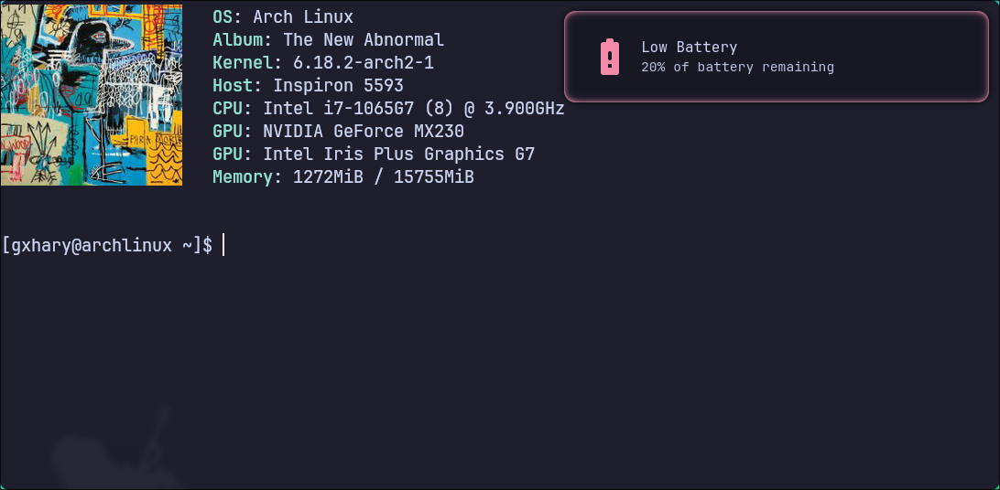

# spider-volt

`Anyone can wear the mask [Even a crab running in the background]` - Stan Lee

A friendly neighborhood battery notification daemon written in Rust.


## Features

- Battery level monitoring
- Charger notifications
- Clean desktop notifications without spam
- Fully customizable 
- Lightweight and efficient
- Written in Rust


## Who may use this

If you’re using a minimal Linux setup with a window manager (like Hyprland, Sway, or i3) instead of a full desktop environment, a lot of small things you normally take for granted are missing. One of those is battery notifications.  
When I switched to Arch Linux with Hyprland, I realized there was no battery notification service by default, so I ended up writing this project to solve that.

## Installation

### Via Cargo Install
```bash
cargo install --git https://github.com/ahmadlgohary/spider-volt
spider-volt --help
```
### Build from source
```bash
git clone https://github.com/ahmadlgohary/spider-volt.git
cd spider-volt/
cargo build --release
sudo mv target/release/spider-volt /usr/local/bin/
spider-volt --help
```

## Usage
### Command Line Interface
```bash
> spider-volt --help

A lightweight battery notification daemon in rust

Usage: spider-volt [OPTIONS]

Options:
  -c, --config <FILE>          Path to config file
      --print-config           Print the current configuration and exit
      --print-config-template  Print the config template and exit
      --create-config          Create '~/.config/spider-volt/config.toml' if missing and exit
  -h, --help                   Print help
  -V, --version                Print version
```

**Notes:**
  - `-c, --config <FILE>` uses a custom config file instead of the one in `~/.config/spider-volt/`
  - Not passing any argument would start the daemon and use the config file in `~/.config/spider-volt`
  - If config file is not found the default config is used

More info in [configuration](#configuration)

### Running as a daemon

#### On window manager startup

You can also start it from your window manager configuration.

**Hyprland Example:**
```ini
exec-once = spider-volt
``` 

#### As a systemd user service

It can be run as a systemd daemon.  
The [spider-volt.service](systemd/spider-volt.service) file needs some configuration:
- `ExecStart=/usr/bin/spider-volt` should be set to the path of the binary
  - If built from source given the steps above, the path should be `/usr/bin/spider-volt`
  - If built using cargo, the path should be `%h/.cargo/bin/spider-volt`
- `Requires=dbus.service pipewire.service` and `After=dbus.service pipewire.service`  should be set to the dbus service and the audio service of the system

```bash
# Copy the spider-volt.service file from the project dir to  /usr/lib/systemd/user
sudo cp systemd/spider-volt.service /usr/lib/systemd/user/
# Start the service
systemctl --user start spider-volt.service
# Check the service to ensure it is running
systemctl --user status spider-volt.service
# To enable the service to start automatically at boot time 
systemctl --user enable spider-volt.service
```

## Configuration
An example configuration file, with comments, can be found [here](config.toml)

### Default Configuration
The default configuration sends a notification when the battery is discharging and at 20%, everything else defaults to false.

```ini
notification_time = 5000
[low_battery_levels.20]

message = "Battery Low"
```
However, when writing a custom config, everything is optional to include; a configuration that does nothing can simply be
```ini
notification_time = 5000
```
This configuration would run and does nothing, which defeats the purpose of this program, but this is just to demonstrate the customization options. 

### Configuration Details
### Notification Time
It is a value to determine how long a notification should be visible for.
```ini
# Optional field, defaults to 5000 ms (5 Seconds)
notification_time = 5000
```

#### Low Battery Notifications
The template for the low battery notifications is as follows:

```ini
[low_battery_levels.N] # where N is the battery level to send a notification at

# this is the only field that is NOT optional
message = "Message To Show in Notification"

# the following fields are optional and they default to None

# Note if using a full path `~` cannot be used, use `/home/username/` instead
# Can be a full path or an icon name in ~/.local/share/icons
notification_icon = "optional-icon-for-notification"

# Full path to sound file
notification_icon = "optional-icon-for-notification"

# urgency level [low, normal, critical], defaults to normal
urgent_level = "urgency-level-low-normal-or-critical"
```
Low Battery Notifications Example:
```ini
[low_battery_levels.10] # send notification when battery <= 10%
message = "Battery Critically Low"
notification_icon = "battery-alert"
notification_sound = "/home/username/.config/scripts/assets/battery_low.ogg"
urgent_level = "Critical"
```

#### High Battery Notifications
The high battery notification template is very similar to the low battery configuration.  
The only difference is the field name being `high_battery_levels` instead of `low_battery_levels`

Template is as follows:

```ini
[high_battery_levels.N] # where N is the battery level to send a notification at

# this is the only field that is NOT optional
message = "Message To Show in Notification"

# the following fields are optional and they default to None

# Note if using a full path `~` cannot be used, use `/home/username/` instead
# Can be a full path or an icon name in ~/.local/share/icons
notification_icon = "optional-icon-for-notification"

# Full path to sound file
notification_sound = "optional-path-to-notification-sound"

# urgency level [low, normal, critical], defaults to normal
urgent_level = "urgency-level-low-normal-or-critical"
```
High Battery Notifications Example:
```ini
[high_battery_levels.90] # send notification when battery >= 90%
message = "Battery Fully Charged"
notification_icon = "battery-charged"
notification_sound = "/home/username/.config/scripts/assets/battery_low.ogg"
urgent_level = "Critical"
```
#### Charger Notifications
This section determines whether to send a notification when the charger is plugged or unplugged. This section is also optional.  
Template:
```ini
[charger_notifications]
# all values are optional
charging = true/false # send a notification when the charger is plugged in
charging_icon = "optional-icon-for-notification"
plugged_sound = "optional-path-to-notification-sound"

discharging = true/false # send a notification when the charger is unplugged 
discharging_icon = "optional-icon-for-notification"
unplugged_sound = "optional-path-to-notification-sound"

# urgency level for charger notifications [low, normal, critical], defaults to normal
urgent_level = "urgency-level-low-normal-or-critical"
```
Charger Notifications Example:
```ini
[charger_notifications]
charging = true
charging_icon = "battery-charging"
plugged_sound = "/home/username/.config/scripts/assets/battery_charging.ogg"

discharging = true
discharging_icon = "battery-discharging"
unplugged_sound = "/home/username/.config/scripts/assets/battery_discharging.mp3"

urgent_level = "Normal"
```
### Full Configuration file example
A full configuration file example, with comments, can be found [here](config.toml)
```ini
notification_time = 5000

[high_battery_levels.100] 
message = "Battery Fully Charged"
notification_icon = "battery-charged"
notification_sound = "/home/username/.config/scripts/assets/battery_charging.ogg"
urgent_level = "Critical"

[low_battery_levels.20]
message = "Battery Low"
notification_icon = "battery-alert"
urgent_level = "Critical"

[low_battery_levels.10]
message = "Battery Critically Low"
notification_icon = "battery-alert"
notification_sound = "/home/username/.config/scripts/assets/battery_low.ogg"
urgent_level = "Critical"

[charger_notifications]
charging = true
charging_icon = "battery-charging"
plugged_sound = "/home/username/.config/scripts/assets/battery_charging.ogg"

discharging = true
discharging_icon = "battery-discharging"
unplugged_sound = "/home/username/.config/scripts/assets/battery_discharging.mp3"

urgent_level = "Normal"
``` 

## License

Distributed under the MIT License. See `LICENSE` for more information.

## Contributing

Contributions welcome! Feel free to open an issue or submit a PR.

### Ways to Contribute

- Add tests and try to break the program :) 
- Implement new features
- Improve or refine existing features
- Improve existing behavior or performance